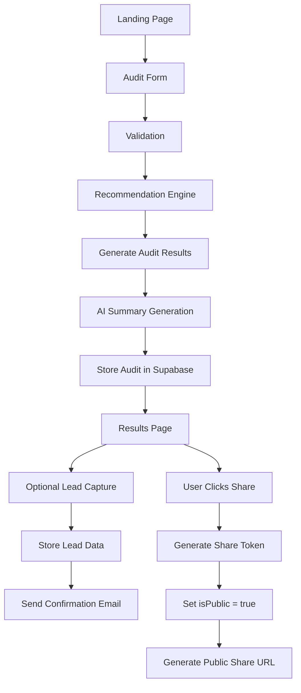

# AI Spend Audit — Architecture

## Goal

A web app that helps startups check if they are overspending on AI tools like ChatGPT, Claude, Cursor, Copilot, Gemini.

User enters tools, plans, monthly spend, team size, and use case. The app analyzes overlapping tools, unnecessary plans, cheaper alternatives, and possible savings — then generates an audit report.

Main goal was: build something realistic, keep architecture simple, ship fast.

---

# Stack

| Layer      | Tech                    |
| ---------- | ----------------------- |
| Frontend   | Next.js 16 App Router   |
| Language   | TypeScript              |
| Styling    | Tailwind v4 + shadcn/ui |
| Forms      | React Hook Form + Zod   |
| Database   | Supabase Postgres       |
| ORM        | Prisma                  |
| AI Summary | Anthropic API           |
| Emails     | Resend                  |
| Testing    | Vitest                  |
| Deployment | Vercel                  |

---

# Why This Stack

**Next.js** — fast development, built-in routing, server components, easy Vercel deployment. For a 7-day MVP, shipping speed mattered more than complex architecture.

**TypeScript** — recommendation logic has pricing rules, calculations, and structured data. TypeScript reduced mistakes and made the engine easier to maintain.

**Supabase + Prisma** — real DB persistence with fast setup and less backend overhead. Prisma made schemas cleaner, queries type-safe, and development easier.

**Tailwind + shadcn/ui** — goal was to make UI feel like a real SaaS product. Tailwind handled fast iteration and consistent spacing. shadcn/ui kept components customizable and clean.

---

# System Flow



---

# Application Flow

## User Input

User enters tools, plans, seats, spend, use case, and team size. After validation, the recommendation engine runs, savings are calculated, and an AI summary is generated. The audit is then stored in Supabase.

localStorage is only used for temporary draft recovery.

## Recommendation Engine

The recommendation system is rule-based. I intentionally avoided AI for pricing calculations because they are harder to test, produce inconsistent outputs, and are difficult to verify financially.

Examples: downgrade unnecessary plans, detect overlapping tools, suggest cheaper alternatives.

This keeps recommendations deterministic, explainable, and testable.

## AI Summary

Anthropic API is only used for summarization and personalization — not recommendation calculations. Fallback summaries are used if AI requests fail.

## Database Storage

All audits are stored immediately after generation. Audits are private by default (`isPublic = false`). When user clicks share, a share token is generated and `isPublic` becomes true.

Lead data is stored separately from audit data.

## Shareable Reports

Public share pages use `/share/[token]`. They only show recommendations, savings, and AI summary — intentionally excluding email, company name, and private metadata.

---

# Backend Architecture

Backend is intentionally minimal. All operations go through API routes:

```
POST  /api/audits              — create audit
GET   /api/audits/[id]         — fetch audit by ID or share token
PATCH /api/audits/[id]/share   — toggle public sharing
POST  /api/leads               — create lead info attached to audit
```

---

# Folder Structure

```
app/
components/
  layout/
  ui/
lib/
  ai/
  audit-engine/
  db/
  pricing/
  utils/
  validations/
prisma/
tests/
types/
```

---

# Scalability Thoughts

If scaled later: caching, background jobs, analytics pipelines, queue-based email processing.

For this MVP, priority was speed, simplicity, and maintainability — not premature scaling.

---

# Design Priorities

Clean UI, modern SaaS feel, readable reports, screenshot-worthy results page.

Inspired by Linear, Vercel, and Stripe.

Intentionally avoided excessive animations, cluttered dashboards, and unnecessary effects.
