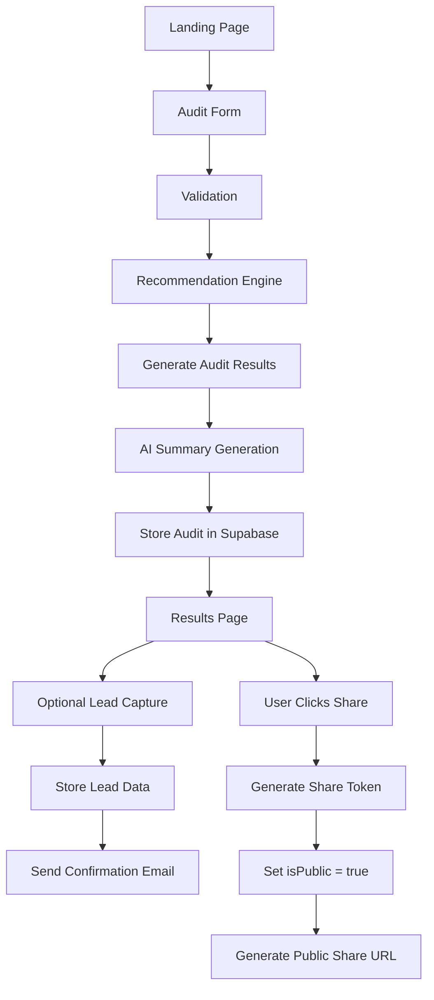

# AI Spend Audit

A SaaS-style web app that helps startups and small teams check if they are overspending on AI tools.

Users enter their AI tools, plans, monthly spend, team size, and use case.

The app generates savings estimates, downgrade suggestions, overlapping tool detection, and an AI-generated audit summary.

---

# Problem

Startups now use multiple AI tools together — ChatGPT, Claude, Cursor, Copilot, Gemini, API credits.

Many teams overlap subscriptions, pay for unnecessary tiers, use multiple tools for the same workflows, and have no visibility into AI spending.

This project solves that with a lightweight audit experience.

---

# Features

- AI tooling audit form
- Rule-based recommendation engine
- Savings calculations
- AI-generated audit summaries
- Public shareable audit reports
- Open Graph previews
- Optional lead capture
- Responsive dark SaaS UI

---

# Tech Stack

| Layer      | Tech                    |
| ---------- | ----------------------- |
| Frontend   | Next.js 16 App Router   |
| Language   | TypeScript              |
| Styling    | Tailwind v4 + shadcn/ui |
| Forms      | React Hook Form + Zod   |
| Database   | Supabase Postgres       |
| ORM        | Prisma                  |
| AI Summary | Anthropic API           |
| Emails     | Resend                  |
| Testing    | Vitest                  |
| Deployment | Vercel                  |

---

# Project Philosophy

Architecture is intentionally simple, modular, and MVP-focused.

Main goal was fast iteration, believable recommendations, polished UX, and realistic startup execution.

---

# Recommendation Engine

Rule-based instead of AI-generated.

Reason: deterministic outputs, easier testing, explainable recommendations, financially verifiable logic.

Examples: downgrade unnecessary plans, consolidate overlapping tools, reduce overspending, optimize API credits.

AI is only used for summaries and personalization — not recommendation calculations.

---

# Data Flow



---

# Backend Architecture

All operations go through API routes.

Routes:

```
POST  /api/audits              — create audit
GET   /api/audits/[id]         — fetch audit by ID or share token
PATCH /api/audits/[id]/share   — toggle public sharing
POST  /api/leads               — create lead info attached to an audit
```

---

# Folder Structure

```
app/
components/
  layout/
  ui/
lib/
  ai/
  audit-engine/
  db/
  pricing/
  utils/
  validations/
prisma/
tests/
types/
```

---

# Local Development

```bash
npm install
npm run dev
npm run test
```

---

# Environment Variables

Create `.env`:

```env
DATABASE_URL=

NEXT_PUBLIC_SUPABASE_URL=
NEXT_PUBLIC_SUPABASE_ANON_KEY=

ANTHROPIC_API_KEY=

RESEND_API_KEY=
RESEND_FROM_EMAIL="[EMAIL_ADDRESS]"
```

---

# Design Direction

Inspired by Linear, Vercel, and Stripe.

Priorities: readability, trust, clean spacing, premium dashboard feel, screenshot-worthy results.

---

# Future Improvements

If continued further: authentication, audit history, organization dashboards, usage analytics, benchmarking, team collaboration.

---

# Assignment Notes

Built as part of the Credex Web Development Internship assignment.

Focus areas: startup thinking, product execution, realistic MVP, engineering tradeoffs, recommendation system design, UX polish.
